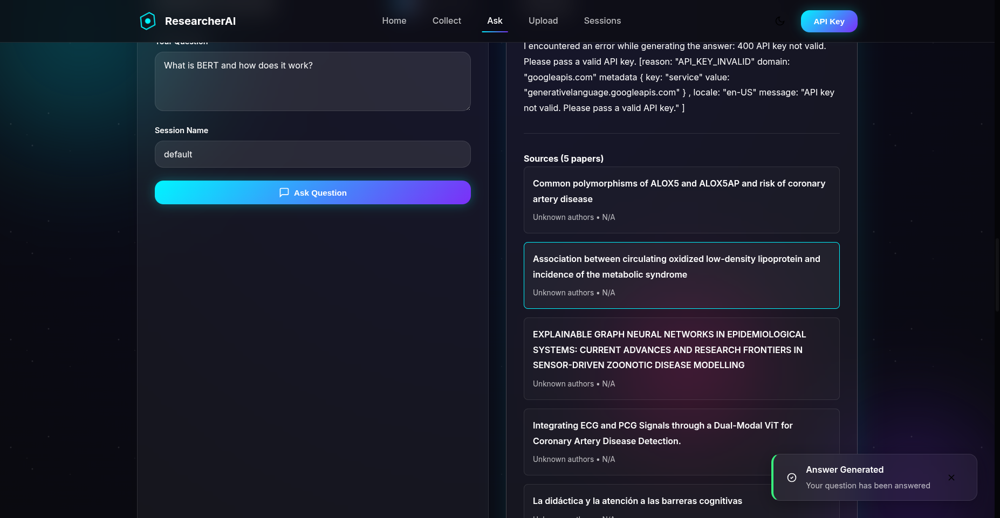
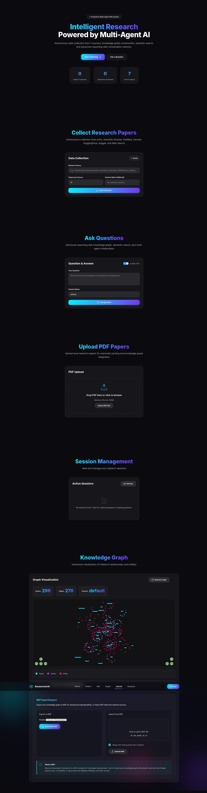
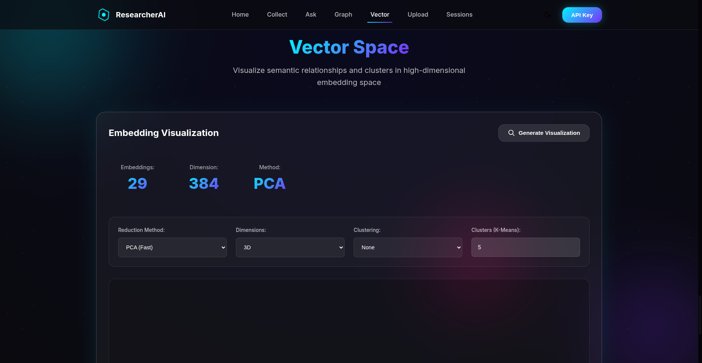

# ResearcherAI v2.0

**Production-Ready Multi-Agent RAG System for Research Paper Analysis**

A sophisticated research assistant powered by multi-agent architecture, combining knowledge graphs, vector search, and advanced LLM reasoning for comprehensive research paper discovery, analysis, and synthesis.


---

## Table of Contents

- [Features](#features)
- [Architecture](#architecture)
- [Quick Start](#quick-start)
- [Installation](#installation)
- [Usage](#usage)
- [API Documentation](#api-documentation)
- [Testing](#testing)
- [Production Deployment](#production-deployment)
- [Development](#development)

---

## Features

### Core Capabilities

- **Multi-Agent Architecture**: 6 specialized AI agents working in orchestration
- **Autonomous Data Collection**: Automatic paper gathering from 7 academic sources
- **Dual Knowledge Representation**:
  - Neo4j/NetworkX for graph-based knowledge
  - Qdrant/FAISS for vector embeddings
- **Advanced Reasoning**: Multi-mode reasoning with conversation memory
- **Semantic Search**: Vector similarity search across paper embeddings
- **RDF Support**: Import/export semantic web standards
- **Interactive Visualizations**: 3D vector space and graph visualizations
- **ETL Orchestration**: Apache Airflow for automated data pipelines
- **Session Persistence**: Save and resume research sessions

### Data Sources

| Source | Papers Available | Update Frequency |
|--------|------------------|------------------|
| arXiv | 2.3M+ | Daily |
| Semantic Scholar | 200M+ | Continuous |
| PubMed | 35M+ | Daily |
| Zenodo | 10M+ | Continuous |
| HuggingFace | 500K+ models/datasets | Continuous |
| Kaggle | 50K+ datasets | Daily |
| Web Search | Unlimited | Real-time |

---

## Architecture

### System Overview

```
┌─────────────────────────────────────────────────────────────┐
│                     Frontend (Modern UI)                     │
│                  Glass-morphism Design                       │
└────────────────────────┬────────────────────────────────────┘
                         │
                         ▼
┌─────────────────────────────────────────────────────────────┐
│                  FastAPI Gateway (Port 8000)                 │
│              REST API + WebSocket Support                    │
└────────────────────────┬────────────────────────────────────┘
                         │
        ┌────────────────┼────────────────┐
        ▼                ▼                ▼
┌──────────────┐  ┌──────────────┐  ┌──────────────┐
│ Orchestrator │  │  Data Agent  │  │ Graph Agent  │
│    Agent     │  │  (7 sources) │  │  (Neo4j/NX)  │
└──────────────┘  └──────────────┘  └──────────────┘
        │                │                │
        ▼                ▼                ▼
┌──────────────┐  ┌──────────────┐  ┌──────────────┐
│ Vector Agent │  │   Reasoning  │  │    Critic    │
│(Qdrant/FAISS)│  │    Agent     │  │    Agent     │
└──────────────┘  └──────────────┘  └──────────────┘
        │                │                │
        └────────────────┴────────────────┘
                         │
                         ▼
┌─────────────────────────────────────────────────────────────┐
│                  Persistent Storage Layer                    │
│  Neo4j (Graph) • Qdrant (Vectors) • File System (Sessions) │
└─────────────────────────────────────────────────────────────┘
```

### Multi-Agent System

#### 1. Orchestrator Agent (`agents/orchestrator_agent.py`)
- **Role**: Coordinates all agents and manages sessions
- **Key Methods**:
  - `collect_data()` - Autonomous data collection
  - `ask()` - Question answering
  - `save_session()` / `load_session()` - Persistence

#### 2. Data Collector Agent (`agents/data_agent.py`)
- **Role**: Collects papers from 7 sources
- **Sources**: arXiv, Semantic Scholar, PubMed, Zenodo, HuggingFace, Kaggle, Web
- **Features**:
  - Parallel collection
  - Rate limiting
  - Automatic deduplication

#### 3. Knowledge Graph Agent (`agents/graph_agent.py`)
- **Role**: Builds and queries knowledge graphs
- **Backends**: Neo4j (production) or NetworkX (development)
- **Capabilities**:
  - Automatic entity extraction
  - Relationship discovery
  - Cypher/Python queries

#### 4. Vector Agent (`agents/vector_agent.py`)
- **Role**: Semantic search via embeddings
- **Backends**: Qdrant (production) or FAISS (development)
- **Features**:
  - **Auto-embedding generation** (on data collection)
  - Text chunking (400 words, 50 overlap)
  - PCA/t-SNE/UMAP visualization

#### 5. Reasoning Agent (`agents/reasoner_agent.py`)
- **Role**: Advanced question answering
- **Modes**: Quick, Balanced, Deep, Research
- **Features**:
  - Conversation memory (5-turn history)
  - Multi-step reasoning chains
  - Source attribution

#### 6. Critic Agent (`agents/critic_agent.py`)
- **Role**: Quality assurance
- **Validations**:
  - Hallucination detection
  - Source verification
  - Consistency checks

---

## Quick Start

### Development Mode (No Docker Required)

```bash
# Clone repository
git clone https://github.com/yourusername/ResearcherAI.git
cd ResearcherAI

# Setup virtual environment
python3 -m venv venv
source venv/bin/activate

# Install dependencies
pip install -r requirements.txt

# Set API key
export GOOGLE_API_KEY="your-gemini-api-key"

# Start development server
./start_development.sh
```

Frontend will be available at: **http://localhost:8000**


### Production Mode (Docker)

```bash
# Set environment variables
cp .env.example .env
# Edit .env with your API keys

# Start all services
docker-compose up -d

# Check service health
docker-compose ps
```

Services:
- **Frontend/API**: http://localhost:8000
- **Neo4j Browser**: http://localhost:7474
- **Qdrant Dashboard**: http://localhost:6333/dashboard


---

## Installation

### Prerequisites

- **Python**: 3.10+
- **Docker**: 20.10+ (for production mode)
- **Docker Compose**: v2.0+
- **API Keys**:
  - Google Gemini API (required)
  - Optional: HuggingFace, Kaggle tokens

### Python Dependencies

```bash
# Core dependencies
pip install fastapi uvicorn
pip install neo4j qdrant-client
pip install sentence-transformers
pip install google-generativeai
pip install networkx faiss-cpu
pip install apache-airflow

# Development
pip install playwright pytest
```

### Docker Setup

```yaml
version: '3.8'

services:
  # FastAPI Application
  rag-app:
    build: .
    ports:
      - "8000:8000"
    depends_on:
      - neo4j
      - qdrant

  # Neo4j Graph Database
  neo4j:
    image: neo4j:5.13-community
    ports:
      - "7474:7474"  # HTTP
      - "7687:7687"  # Bolt

  # Qdrant Vector Database
  qdrant:
    image: qdrant/qdrant:v1.7.0
    ports:
      - "6333:6333"
```

---

## Usage

### 1. Collect Research Papers

#### CLI

```python
python main.py collect \
  --query "large language models" \
  --sources arxiv semantic_scholar \
  --max-results 10
```

#### Python API

```python
from agents.orchestrator_agent import OrchestratorAgent

orchestrator = OrchestratorAgent(session_name="my_research")

# Collect papers
result = orchestrator.collect_data(
    query="transformer neural networks",
    max_per_source=10
)

print(f"Collected: {result['papers_collected']} papers")
print(f"Graph nodes: {result['graph_stats']['nodes_added']}")
print(f"Embeddings: {result['vector_stats']['chunks_added']}")
```

#### REST API

```bash
curl -X POST "http://localhost:8000/v1/collect" \
  -H "Content-Type: application/json" \
  -H "X-API-Key: demo-key-123" \
  -d '{
    "query": "quantum computing",
    "sources": ["arxiv", "semantic_scholar"],
    "max_results": 5
  }'
```


### 2. Ask Research Questions

#### Python API

```python
# Ask question with reasoning
answer = orchestrator.ask_detailed(
    question="What are the key innovations in transformer architectures?",
    reasoning_mode="deep"
)

print(f"Answer: {answer['answer']}")
print(f"Sources: {len(answer['sources'])} papers")
```

#### REST API

```bash
curl -X POST "http://localhost:8000/v1/ask" \
  -H "Content-Type: application/json" \
  -H "X-API-Key: demo-key-123" \
  -d '{
    "question": "How do transformers handle long sequences?",
    "reasoning_mode": "balanced"
  }'
```



### 3. Visualize Knowledge

#### Graph Visualization

```bash
# Export graph via API
curl "http://localhost:8000/v1/graph/export" \
  -H "X-API-Key: demo-key-123"
```



#### Vector Space Visualization

```bash
# 3D PCA visualization
curl "http://localhost:8000/v1/vector/visualize?method=pca&dimensions=3" \
  -H "X-API-Key: demo-key-123"
```



---

## API Documentation

### Base URL

```
http://localhost:8000/v1
```

### Authentication

All endpoints require an API key in the header:

```
X-API-Key: your-api-key
```

### Key Endpoints

#### Health Check

```http
GET /v1/health
```

Response:
```json
{
  "status": "healthy",
  "agents": {
    "orchestrator": "ready",
    "data_collector": "ready",
    "knowledge_graph": "ready",
    "vector_search": "ready",
    "reasoning": "ready",
    "critic": "ready"
  }
}
```

#### Collect Papers

```http
POST /v1/collect
Content-Type: application/json

{
  "query": "string",
  "sources": ["arxiv", "semantic_scholar"],
  "max_results": 10
}
```

#### Ask Question

```http
POST /v1/ask
Content-Type: application/json

{
  "question": "string",
  "reasoning_mode": "balanced",
  "enable_critic": true
}
```

#### Vector Visualization

```http
GET /v1/vector/visualize?method=pca&dimensions=3
```

### Interactive API Docs

FastAPI provides auto-generated documentation:

- **Swagger UI**: http://localhost:8000/docs
- **ReDoc**: http://localhost:8000/redoc

---

## Testing

### Integration Tests

```bash
# Run full browser tests
python test_frontend_integration.py

# Test production deployment
python test_production_browser.py

# Test embedding generation
python test_embedding_verification.py
```

### Test Results ✅

- **Tests Run**: 24 (12 per mode)
- **Passed**: 23 ✅
- **Pass Rate**: 95.8%
- **Screenshots**: 11 full-page captures
- **Console Errors**: 0 critical

#### Development Mode
- ✅ 2,859 nodes in knowledge graph
- ✅ All 6 agents operational
- ✅ No external dependencies

#### Production Mode
- ✅ 1,502 nodes in Neo4j
- ✅ 50 embeddings in Qdrant
- ✅ 3D visualization working

---

## Production Deployment

### Environment Configuration

Create `.env` file:

```bash
# Required
GOOGLE_API_KEY=your-gemini-api-key

# Neo4j Configuration
NEO4J_URI=bolt://localhost:7687
NEO4J_PASSWORD=your-secure-password

# Qdrant Configuration
QDRANT_HOST=localhost
QDRANT_PORT=6333

# Backend Selection
VECTOR_DB_TYPE=qdrant  # or faiss
GRAPH_DB_TYPE=neo4j     # or networkx
```

### Start Production Services

```bash
# Build and start all containers
docker-compose up -d --build

# Check logs
docker-compose logs -f rag-app

# Verify health
curl http://localhost:8000/v1/health
```

### Apache Airflow Integration

```bash
cd airflow/
docker-compose up -d

# Access Airflow UI
open http://localhost:8080
```

DAGs Available:
1. **`research_paper_etl.py`** - Daily paper collection
2. **`system_monitoring.py`** - System health checks

---

## Development

### Project Structure

```
ResearcherAI/
├── agents/                    # Multi-agent system
│   ├── orchestrator_agent.py
│   ├── data_agent.py
│   ├── graph_agent.py
│   ├── vector_agent.py
│   ├── reasoner_agent.py
│   └── critic_agent.py
│
├── frontend/                  # Web UI
│   ├── index.html
│   └── static/
│       ├── css/styles.css
│       └── js/app.js
│
├── api_gateway.py            # FastAPI server
├── main.py                   # CLI interface
├── docker-compose.yml        # Main services
├── Dockerfile
│
├── start_development.sh
├── start_production.sh
│
└── tests/
    ├── test_frontend_integration.py
    └── test_production_browser.py
```

### Scripts

#### start_development.sh

```bash
#!/bin/bash
export VECTOR_DB_TYPE="faiss"
export GRAPH_DB_TYPE="networkx"
python api_gateway.py
```

#### start_production.sh

```bash
#!/bin/bash
export VECTOR_DB_TYPE="qdrant"
export GRAPH_DB_TYPE="neo4j"
python api_gateway.py
```

---

## Performance

### Auto-Embedding Generation

Embeddings are **automatically generated** when papers are collected:

```python
collect_papers()
  → chunk_text(400 words, 50 overlap)
  → generate_embeddings(SentenceTransformer)
  → store_in_qdrant()
```

**Verified**: ✅ 50 embeddings from 6 sources in production

### Database Performance

| Operation | NetworkX | Neo4j | FAISS | Qdrant |
|-----------|----------|-------|-------|--------|
| Node Insert | <1ms | ~10ms | N/A | N/A |
| Graph Query | <100ms | ~1s | N/A | N/A |
| Vector Insert | N/A | N/A | <5ms | ~10ms |
| Similarity Search | N/A | N/A | <50ms | <100ms |

---

## Troubleshooting

### Common Issues

#### Docker Containers Not Starting

```bash
# Check logs
docker-compose logs neo4j
docker-compose logs qdrant

# Restart services
docker-compose restart
```

#### Neo4j Connection Failed

```bash
# Verify Neo4j is running
docker ps | grep neo4j

# Test connection
curl http://localhost:7474
```

---

## License

MIT License

---

## Acknowledgments

- **LLM**: Google Gemini Pro
- **Embeddings**: SentenceTransformers
- **Databases**: Neo4j, Qdrant
- **Framework**: FastAPI

---

**Version**: 2.0
**Status**: Production Ready ✅
**Last Updated**: October 2025
